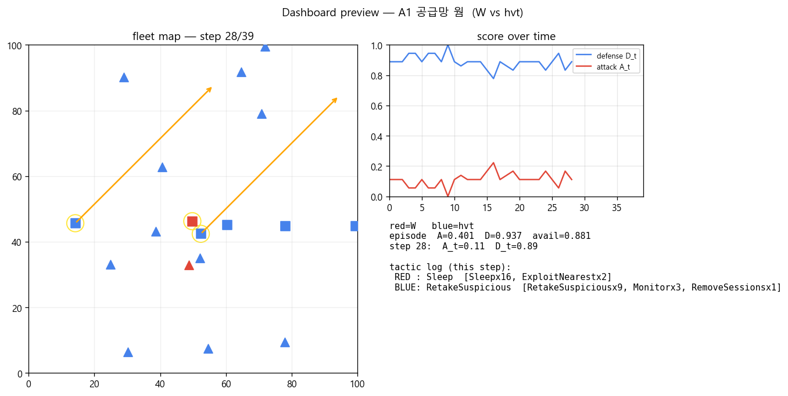
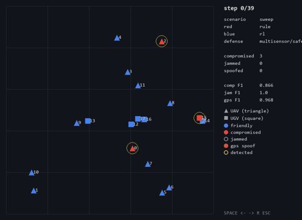
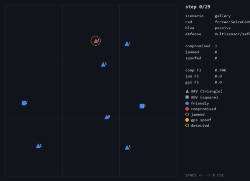
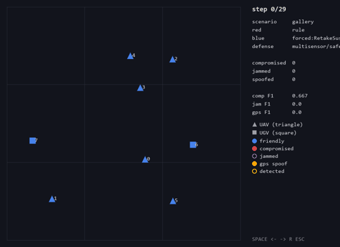

# DroneSwarm 공·방 Lab

CybORG DroneSwarm(CAGE Challenge 3) 위에서 드론 군집의 사이버 공격(red)·방어(blue)를 시뮬레이션하는
실험 도구임. 기본 실행 모델은 **HVT+RAG(rag-guided)** — RAG-A(공격유형 판단)의 attack_class로 대응
자세를 라우팅하고 **HVT(Hypothesis-Verify-Trigger, `src/agents/hvt.py`)** 계열 방어정책이 실행함.
`rule`·`llm`·`rl` 기반 에이전트의 3×3 비교를 베이스라인으로 제공함. RAG 검색 파이프라인(임베딩·KB)은
별도 env를 쓰므로 `appendix/`에 보관함.

- 환경: UAV 12대 + UGV 6대, 100×100 격자.
- 공격 시나리오 A1~A21은 `src/configs/attack_scenarios.yaml`에 정의(MITRE ATT&CK/D3FEND 태그).

## Docs

[데모 영상 (YouTube)](https://youtu.be/w4Xyg006Jx0) · [아키텍처](docs/architecture.md) ·
[데모](docs/demo.md) · [시나리오](docs/scenarios.md) ·
대안 모델 `src/counterpart_models/` · RAG 실험 `appendix/`

## 실험 설계

- **두 채널** — CybORG가 네트워크 점령(익스플로잇·장악·웜 확산)과 보상을 담당함. CybORG에는 GPS/RF
  물리가 없으므로 위치·통신·재밍·GPS 스푸핑은 합성 텔레메트리 레이어(`sim/fleet.py`)가 정답 라벨과
  함께 생성함. 합성 함대의 초기 배치가 시뮬 시작 위치를 시딩하므로 두 채널은 같은 함대를 기술함.
- **행동** — 매 스텝 red/blue가 MITRE 태그가 붙은 고정 카탈로그에서 선택함. red는 정찰·익스플로잇·
  장악·확산·재밍·차단, blue는 감시·분석·세션제거·탈환·차단·자율방어로 구성됨(`src/agents/actions.py`).
- **평가** — 시나리오 × 시드 평균으로 종합점수(0~1)를 산출함. 방어점수 = 평균(1−최종점령, 1−평균점령),
  가용성도 함께 기록함. 실전 조건은 미탐(`--recall`)·오탐(`--fp`)을 반영함.

## HVT 방어

belief 상위를 무조건 재장악하지 않고, 각 후보의 재장악 실익을 world-model 반사실 시뮬로 검증해
트리거를 넘는 것만 파괴적으로 재장악함.

1. **가설** — belief b[i]=P(감염)를 웜확산 전진예측 + 탐지 융합으로 유지함(관측 detected와 인접만 사용).
2. **검증** — 후보 i에 대해 Δ_i = "지금 i를 재장악하면 앞으로 H스텝 막는 확산량"을 반사실로 계산함.
3. **트리거** — Δ_i > τ 인 타겟만 파괴적 재장악(RetakeControl)하고, 나머지는 비파괴 자가치유로 hold함.
4. **실행** — 재장악을 Δ 큰 순으로 다중배정하고 relay·de-jam을 유지함.

`src/agents/defense_base.py`가 `DefensePolicy` 베이스와 그래프 유틸(adjacency·components·retake_target)을
제공하고, `src/score.py`가 시나리오 spec으로 환경을 세워 방어 모델을 구동·채점함. 모델별 차이는
[docs/architecture.md](docs/architecture.md) 참고.

베이스라인 에이전트는 `rule`(휴리스틱 FSM), `llm`(행동 메뉴에서 LLM 선택, 키 없으면 오프라인 stub),
`rl`(tabular Q를 1회 학습 후 고정) 3종임.

## 폴더 구조

```
lab/
├─ src/
│  ├─ score.py                        방어 모델(DefensePolicy) 채점 러너 (기본: rag-guided)
│  ├─ record.py                       실행 기록 → results/ 대시보드 번들 (데모용)
│  ├─ run.py sweep.py analyze.py gallery.py make_dataset.py
│  ├─ agents/
│  │   ├─ hvt.py                      HVT — 메인 방어 모델
│  │   ├─ defense_base.py  reach2.py  DefensePolicy 베이스 · 단순 재장악 방어
│  │   └─ actions·base·brains·hierarchical·llm·multiagent·rl
│  ├─ counterpart_models/             대안 방어 모델 (비실행 참조)
│  └─ sim/  viz/  scenarios/ (A01~A21)  configs/
├─ appendix/                          RAG 파이프라인 (임베딩은 별도 env)
│  ├─ attack_rag/  defense_rag/       RAG-A(공격유형) · RAG-B(방어권고) — KB·인덱스는 rag_data/
│  └─ rag_guided.py  rag_playbook.py  HVT+RAG 통합(score.py 기본 모델) · RAG-lite 플레이북
├─ docs/                              architecture.md · demo.md · scenarios.md · sample_run/
└─ results/ data/                     (생성물, git 제외)
```

## 설치

Python 3.11, CPU. numpy 1.23.5 핀으로 3.12 이상은 미지원.

```bash
python -m venv .venv && source .venv/Scripts/activate   # PowerShell: .venv\Scripts\Activate.ps1
git clone https://github.com/cage-challenge/CybORG
pip install -e ./CybORG --no-deps
pip install -r requirements.txt
```

환경 변수: `ANTHROPIC_API_KEY`(있으면 `llm`이 Claude 호출, 없으면 오프라인 stub),
`SDL_VIDEODRIVER=dummy`(헤드리스 GIF·PNG 저장).

`appendix/`의 RAG 실험은 sentence-transformers 계열의 **별도 env**가 필요하며 sim과 한 프로세스에서
섞이지 않음. 실행법은 `appendix/attack_rag/README.md` 참고.

### Docker (선택)

위 절차를 이미지 하나로 묶은 `Dockerfile`을 제공함. sim과 RAG의 의존성 충돌 때문에
이미지 안에 venv 두 개(`/opt/sim`, `/opt/rag`)로 분리돼 있고, 임베딩 모델을 빌드 시
내려받아 실행 시 네트워크가 필요 없음.

```bash
docker build -t neuroguard .

# 방어 채점 (기본 모델 = HVT+RAG)
docker run --rm neuroguard   # = src/score.py --scenario A17 --recall 0.75 --fp 0.1 --seeds 5

# HVT vs HVT+RAG 비교
docker run --rm --entrypoint bash neuroguard -c 'PATH=/opt/sim/bin:$PATH ./src/compare_hvt_rag.sh'

# RAG 파이프라인 데모 (관측 → 공격판단 → 방어추천, 오프라인)
docker run --rm -w /app/appendix neuroguard /opt/rag/bin/python -m attack_rag.integration_test

# (선택) LLM 근거 생성 — 키를 넘기면 Claude가 후보 중 선택 + 근거 작성
docker run --rm -w /app/appendix -e ANTHROPIC_API_KEY neuroguard /opt/rag/bin/python -m attack_rag.integration_test

# 대시보드 생성 — 산출물을 호스트로 받으려면 results/를 볼륨 마운트
docker run --rm -v "$PWD/results:/app/results" neuroguard \
  /opt/sim/bin/python src/record.py --scenario A17 --recall 0.75 --fp 0.1
docker run --rm -v "$PWD/results:/app/results" neuroguard \
  /opt/sim/bin/python src/viz/dashboard.py results/rag_guided_A17_r0.75_fp0.1
# -> 호스트의 results/rag_guided_A17_r0.75_fp0.1/dashboard.html 을 브라우저로 열기
```

## 실행

```bash
# 방어 채점 — 기본 모델은 HVT+RAG(rag-guided). 옵션: --model hvt · reach2
python src/score.py --scenario A17 --recall 0.75 --fp 0.1 --seeds 5
python src/score.py --scenario A17 --log steps.csv    # step별 상태 CSV

# 실행을 기록해 대시보드로 보기 (데모용, docs/demo.md 참고)
python src/record.py --scenario A17 --recall 0.75 --fp 0.1
python src/viz/dashboard.py results/rag_guided_A17_r0.75_fp0.1   # -> dashboard.html

# 시각화 — docs/sample_run/ 샘플은 CybORG 없이도 동작
python src/viz/dashboard.py docs/sample_run --png   # dashboard.html + 프리뷰 PNG
python src/viz/render.py   docs/sample_run --gif    # 함대 애니메이션 GIF

# 베이스라인 3×3 (rule·llm·rl 공격 3 × 방어 3)
python src/sweep.py src/configs/sweep.yaml          # 첫 실행 시 rl 학습
python src/analyze.py                               # results/ 요약표
```

기본 모델 HVT+RAG(rag-guided)는 RAG-A의 attack_class로 대응 자세를 라우팅해 실전조건(18 실공격,
5시드) 0.904로 HVT(0.906)와 동률이며, 재밍 시나리오에서 오탐 파괴적 재장악을 회피함(A7: 0.946
vs 0.930). HVT 단독은 방어점수 약 0.91(A17, 실전탐지)로, 탐지된 감염을 전부 재장악하는 reach2(약
0.90)보다 오탐 낭비가 적음. 베이스라인 종합점수(5시드, 0~1)는 규칙기반 방어가 가장 높음.

| 방식 | 공격 A | 방어 D |
|---|---|---|
| rule | 0.53 | 0.81 |
| llm  | 0.52 | 0.58 |
| rl   | 0.47 | 0.43 |

## 결과 시각화

범례: 파랑=아군, 빨강=감염, 삼각형=UAV, 네모=UGV, 보라 링=재밍, 주황 화살표=GPS 스푸핑, 노랑 링=탐지.

HVT 대시보드(A1 공급망 웜) — 함대 맵·점수 곡선·전술 로그. 웜 확산을 RetakeSuspicious로 봉쇄(방어 0.94).



함대 애니메이션 — HVT가 감염 드론을 탈환하며 확산 억제.



행동 단독 검증(`gallery.py`) — red SeizeControl(장악), blue RetakeSuspicious(탈환).




베이스라인 rule 대 rule 매치업.


## License

This project is licensed under the MIT License - see the [LICENSE](LICENSE) file for details.
