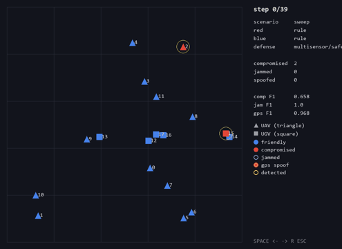
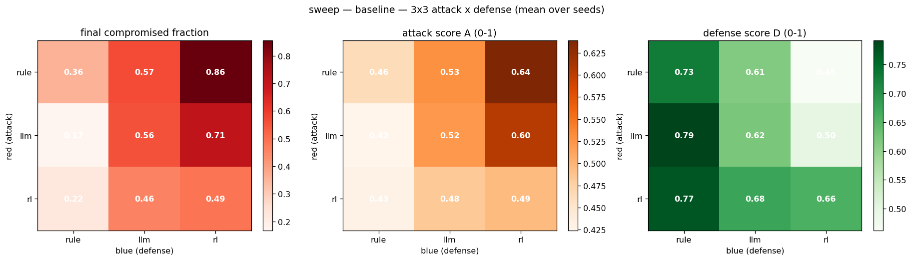

# DroneSwarm Red/Blue Lab — 3×3 Agent Comparison

A small, local experiment harness that pits **cyber attackers (red) against defenders
(blue)** over a swarm of drones, and answers one question: **which kind of agent wins?**

---

## Overview

The lab runs on **CybORG DroneSwarm (CAGE Challenge 3)** with a synthetic fleet of
**12 UAVs + 6 UGVs** moving on a 2D map. Both the attacker and the defender are built in
**three "agent" styles**, and we play every attacker against every defender, giving a
**3×3 grid of 9 matchups**:

| style | how it decides | one line |
| --- | --- | --- |
| `rule` | hand-written heuristic | fast, interpretable, the CAGE-winning recipe |
| `llm` | a language model picks from a menu | offline stub by default, Claude if a key is set |
| `rl` | a learned tabular Q-policy | trained once, then frozen |

Every action is tagged with a **MITRE** technique (ATT&CK for attack, D3FEND for defense),
so the experiment maps onto real-world threats and mitigations.

**Headline result:** the rule-based style is strongest, and it is clearest on **defense**.
Rule-based defense keeps the fleet safest against every attacker (see the grid below).
This matches the CAGE Challenge 4 finding that heuristics beat learned agents.

```
lab/
├─ README.md          ├─ requirements.txt
├─ src/               # all code
│  ├─ sweep.py run.py analyze.py make_dataset.py
│  ├─ agents/    actions.py brains.py llm.py rl.py
│  ├─ sim/       fleet.py defense.py
│  ├─ viz/       plot.py render.py dashboard.py score.py
│  ├─ scenarios/ A01..A21 MITRE attack scenarios + loader
│  └─ configs/*.yaml
├─ docs/              # report, architecture, demo GIFs, sample_run/
└─ results/  data/    # generated output (not in git)
```

---

## Quick Start

Python 3.11, CPU only.

```bash
# 1) install CybORG CC3 (not on PyPI) + pinned deps
git clone https://github.com/cage-challenge/CybORG
pip install -e ./CybORG --no-deps
pip install -r requirements.txt

# 2) run the full 3x3 comparison  (trains the rl policy on first run, ~1 min)
python src/sweep.py src/configs/sweep.yaml            # -> results/sweep_*/
python src/analyze.py                                 # summary table of all runs

# one matchup at a time (red/blue each in {rule, llm, rl})
python src/run.py src/configs/sweep.yaml --red rule --blue rl
python src/viz/render.py <run_id>                     # live viewer; add --gif to save an animation
```

Optional environment variables: set `ANTHROPIC_API_KEY` to make the `llm` agent call
Claude (otherwise a deterministic offline stub is used, so everything runs with no
network); `SDL_VIDEODRIVER=dummy` runs the viewer headless for GIF export.

### Quick test (no CybORG, no full run)

A tiny sample result is committed under `docs/sample_run/`, so you can see the outputs
without installing CybORG or running the simulator. These commands need only
numpy / matplotlib / pillow:

```bash
python src/viz/dashboard.py docs/sample_run   # -> docs/sample_run/dashboard.html (open in a browser)
python src/viz/plot.py docs/sample_run        # -> docs/sample_run/figs/*.png
```

(`docs/sample_run/dashboard.html` is also committed, so you can just open it directly.)

---

## Experiment Settings

**Environment.** 18 entities (12 UAV + 6 UGV) on a 100×100 grid. The simulator has two
channels that share one fleet: the CybORG network channel produces who is **compromised**
and the reward, and a synthetic telemetry channel produces position, signal quality,
**jamming** and **GPS spoofing** with ground-truth labels.

**Action pools.** Both sides choose, each step, from a fixed menu of MITRE-tagged actions
(full list in `src/agents/actions.py`):

- **Attack (red), ~14:** discover, exploit (nearest / random / farthest), seize, spread
  worm, jam, block comms, persist, target-leader, exploit-known, flood-all.
- **Defense (blue), ~13:** monitor, analyse, remove sessions, retake, block, allow,
  deploy decoy, plus passive detectors for jamming / GPS / worm and a safe-mode position fix.

**Scenarios.** Beyond the default mix, 21 MITRE attack scenarios (A01–A21: firmware worm,
GPS spoofing, RF jamming, SATCOM replay, sensor spoofing, multi-domain, and so on) live in
`src/scenarios/`. Run any subset with `python src/sweep.py src/configs/sweep.yaml
--scenarios A1,A7` (or `sim`, or `all`).

**Evaluation.** Each of the 9 matchups is run for **5 random seeds × 40 steps**, then
averaged. We track attack metrics (final compromised fraction, time to first compromise,
spread over time, drones recovered) and defense metrics (cumulative blue reward, worm/
jamming/GPS detection F1, GPS error correction, availability). These roll up into a single
**composite score per side** in `[0,1]` (see Sample Visualization). Reading the 3×3 grid is
simple: scan a **column** to see how one defender does against all attackers, and a **row**
to see how one attacker does against all defenders.

## Agent designs

Both red and blue come in the same three styles; only the decision rule differs.

- **rule (heuristic).** Red: if the last exploit landed, seize that drone, otherwise exploit
  a nearby one (sometimes jam or persist). Blue: if my own drone is compromised, remove the
  intruder; else if any drone is compromised, retake it; else monitor.
- **llm (menu choice).** The current situation and the action menu become a text prompt and a
  language model picks one action. With no API key a deterministic offline stub runs an
  autonomous kill-chain (discover → exploit → seize → spread).
- **rl (learned).** A small tabular Q-policy trained by Monte-Carlo (RL-red vs rule-blue and
  RL-blue vs rule-red), then frozen and used greedily.

Every drone agent acts each step, so many actions happen at once; the dashboard's tactic log
shows each side's most-common action that step plus the counts.

---

## Sample Visualization

The viewer draws the fleet step by step. The colours and shapes mean:

- **Fill colour = team.** Blue is a friendly (defended) drone, red is a compromised drone.
- **Shape = platform.** Triangle is a UAV, square is a UGV.
- **Purple ring = jammed.** **Orange arrow = GPS spoofed** (points from the real position to
  the faked one). **Yellow ring = the defender detected something** on that drone.

**A strong attack vs a weak defense (`rule` attacker, `rl` defender).** The fleet turns red
as the worm spreads and the defender fails to keep up.


**A rule-based defense holding (`rule` vs `rule`).** Drones that turn red are retaken and go
back to blue, so the fleet stays mostly defended.



**One attack action in isolation (SeizeControl).** The attacker takes over a drone and the
red footprint grows. We verified every action this way.


**One defense action in isolation (RetakeSuspicious).** The defender keeps retaking
compromised drones, driving the compromised count to zero.


**Interactive dashboard.** Every matchup also writes a self-contained **`dashboard.html`**
that, in one screen, plays the map animation, shows the per-step **tactic log** (each side's
representative action plus counts), and draws the running **attack/defense score** chart.
Open it in any browser (a committed example is `docs/sample_run/dashboard.html`).

**The 3×3 result at a glance.** Left is the final compromised fraction (lower is better for
the defender), middle is the attack score A, right is the defense score D.



**Single-number verdict (composite score).** Each side gets one score in `[0,1]`: attack
score A (spread + takeover + speed + stealth) and defense score D (containment + worm
detection + availability), each a plain average of those parts. Averaged over the 9 matchups
(5 seeds):

| agentic | attack score A | defense score D |
| --- | --- | --- |
| **rule** | 0.54 | 0.77 |
| **llm** | 0.52 | 0.64 |
| **rl** | 0.47 | 0.54 |

`rule` wins on both sides and is clearest on defense, matching the CAGE Challenge 4 finding
that heuristics beat learned agents. A GIF for every matchup and every action, plus
per-matchup figures and dashboards, regenerate under `results/` (not committed, to keep the
repo light).

---

## More

- **Architecture and design:** `docs/architecture.md`
- **Visualisation details and all commands:** `docs/demo.md`
- **Full write-up (report):** `docs/report.md`
- **Extend it:** add an action in `src/agents/actions.py` and a branch in
  `src/agents/brains.py`; add a detector in `src/sim/defense.py`; add a scenario YAML in
  `src/configs/`.
- **Limitation:** jamming and GPS spoofing are signal/geometry abstractions, not RF or
  navigation physics, so their detection scores depend on the scenario settings. The agent
  comparison itself happens on the real CybORG network channel.
