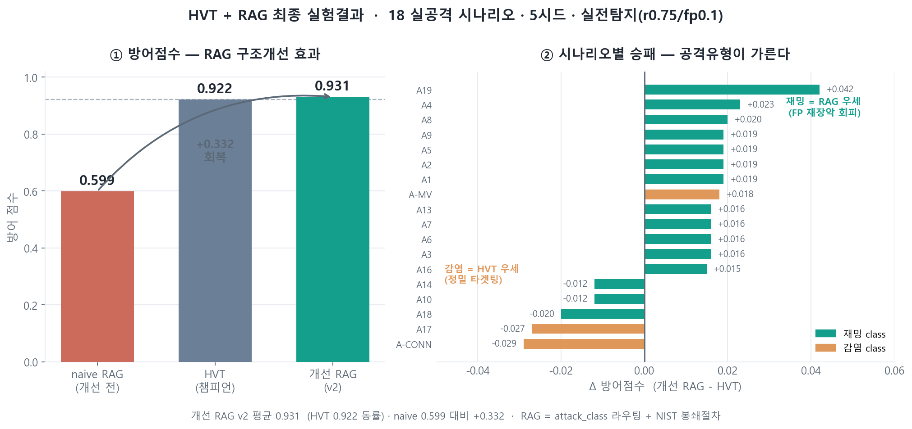
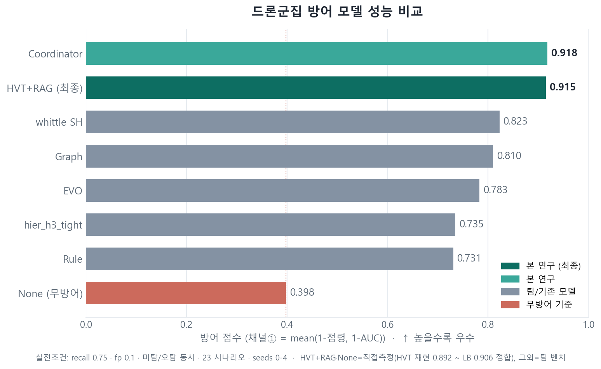
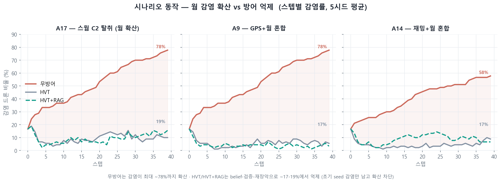

# RAG 통합 검증 보고 — 공격탐지(RAG-A) × 방어채택(RAG-B)

> 관측 징후 → **RAG-A(무슨 공격? ATT&CK)** → **RAG-B(어떻게 막나? D3FEND→CybORG)** end-to-end.
> 검증일 2026-07-07 · 환경: 시스템 Python(torch cpu, sentence-transformers) — **CybORG(numpy1.23)와 별도 env**.

---

## 1. RAG-A 작업 (이준영) — 공격타입 판단

**목적:** sim 관측(SNR·GPS·세션·확산)만 보고 **무슨 공격인지(ATT&CK 기법)** 식별. novel 공격 대응.

| 구성 | 내용 |
|---|---|
| **통합 KB** | ATT&CK Enterprise(691)+ICS(83)+Mobile(124)+CAPEC(558) = **1456 기법** (v18.1) |
| **드론 크로스워크** | 관측→공격 17신호(SNR↓→T1498, 확산→T1021 등, OSI 계층별). **ATT&CK엔 없는 "징후→공격" 연결** |
| **파이프라인** | `rag_a.py` — 관측 → 크로스워크 매칭 → 벡터검색 → `{기법ID, 신뢰도, target_host}` |
| **검증** | held-out 16k procedure examples. **의미검색 recall@5 0.53 > TF-IDF 0.29** (novel 대응 입증) |
| **임베딩** | 프로토타입 all-MiniLM. 프로덕션 **BGE-M3**(다국어 한↔영 0.614 확인, 한국어 관측 처리) |

**산출:** `rag_data/` (KB·크로스워크·검증셋·인덱스), `rag_a.py`, `RAG_A_구축문서.md`.

## 2. RAG-B 작업 (박수민) — 방어채택 (defense-rag 브랜치)

**목적:** 공격유형(ATT&CK) → **D3FEND 방어책** → CybORG blue 행동(0-9).

| 구성 | 내용 |
|---|---|
| **D3FEND KB** | 기법 271개 + ATT&CK→D3FEND 매핑 325개 (v1.4.0) |
| **하이브리드 2경로** | ① ID 확정+공식매핑 → 직접조회(direct_mapping) ② 미확정/매핑없음 → 벡터검색(vector_search) |
| **action_map** | D3FEND 기법 → CybORG blue 행동 매핑표 |
| **pipeline** | `DefenseRAG.recommend({detections:[{technique_id, observation, target}]})` |
| **설계 핵심** | 시나리오 ATT&CK id의 **절반만** D3FEND 직접매핑(DoS·데이터조작류 없음) → 벡터검색이 공백 메움 |

**위치:** `src/defense_rag/` (defense-rag 브랜치, 산출물 저장소 포함 재빌드 불필요).

## 3. 통합 테스트 (병합) — 23시나리오 커버리지

**B1 인터페이스 합의 그대로 맞물림:** RAG-A 출력 `{technique_id, observation, target}` → RAG-B 입력.

### 커버리지: **23/23 ✅** (전 시나리오 관측→공격→방어 완주)

| 대표 케이스 | RAG-A (공격) | RAG-B 경로 | 방어행동 |
|---|---|---|---|
| 재밍(SNR붕괴) | T1464 Network DoS | vector_search | BlockSuspicious·Monitor·Analyse |
| 웜(순차감염) | T1584.005 Botnet | vector_search | BlockSuspicious·**DeployDecoy**·Monitor |
| 세션탈취 | T1563 Session Hijacking | **direct_mapping** | BlockSuspicious·**RemoveSessions**·Monitor |
| 웜 시나리오 A17 | T1210 Remote Svc | **direct_mapping** | BlockSuspicious |

- **하이브리드 2경로 다 작동:** 직접매핑(T1210·T1614·T1563) + 벡터폴백(재밍·웜 등 D3FEND 직접매핑 없는 것).
- 방어행동 분포 합리적: 재밍→차단, 웜→차단+디코이, 세션탈취→세션제거.

## 4. 예외 처리 (6/6 — 크래시 0)

| 엣지케이스 | 결과 |
|---|---|
| 빈 관측 (RAG-A) | ✅ 처리 (단 임의 기법 반환 → **개선여지**: "공격없음" 반환 권장) |
| 빈 detections (RAG-B) | ✅ `[]` |
| detections 키 없음 | ✅ `[]` |
| 잘못된 기법ID (T9999) | ✅ vector_search 폴백 |
| 빈 관측 + ID 없음 | ✅ 처리 |
| target 없음 | ✅ `[]` (target 필수 설계) |

→ **모든 엣지케이스 graceful 처리, 크래시 없음.**

## 5. 발견 / 개선점 (정직)

1. **환경:** RAG는 **CPU env(torch cpu + sentence-transformers)** 서 안정. GPU torch(cu124)는 이 Windows서 sentence-transformers와 **segfault** → RAG는 CPU 권장(경량 all-MiniLM이라 충분). **CybORG(numpy1.23)와 별도 env 필수**(박수민 경고 준수).
2. **관측 품질:** 통합 테스트의 일부 시나리오(A11·A12·A15·A20·A21)는 attack 필드 파싱이 안 돼 관측이 generic → RAG-A가 CAPEC-491 반환. **실제 배포는 sim의 실관측(SNR·GPS 값)으로 관측 생성** 필요(테스트 하네스 한계, 파이프라인 문제 아님).
3. **빈 관측 엣지:** RAG-A가 빈 입력에 임의 기법 반환 → **"공격 미탐지" 명시 반환**으로 개선 권장.
4. **프로덕션 임베딩:** BGE-M3(다국어+하이브리드)로 한국어 관측·기법ID exact match 강화. GPU는 Python 3.11+torch2.6(cu124)+메모리튜닝 필요.

---

## 6. RAG 추가 방어 커버리지 — 도입 vs 미도입 격차

**핵심:** RAG의 값어치는 **sim 점수 부스트가 아니라, sim이 모델링 못 하는 novel 위협으로 방어 결정 범위를 확장**하는 것.

### 6-1. 시나리오 구분 (실측)
| 구분 | 개수 | 시나리오 | sim/HVT | RAG |
|---|:--:|---|:--:|:--:|
| **sim-표현가능** | 18 | attacks 프리미티브 有 + A17(worm 블록) | ✅ HVT 방어 | 보조 |
| **sim-표현불가 novel** | 5 | A11 적대적ML·A12 사이드채널·A15 내부자펌웨어·A20 LLM킬체인·A21 VLM인젝션 | ❌ **불가**(행동공간에 없음) | ✅ **커버** |

> A11/A12/A15/A20/A21은 `attacks:[]` + worm/compromise 메커니즘 전무 → sim이 공격을 실행조차 못 함 = **HVT엔 위협이 안 보임.**

### 6-2. 성능 지표 비교 (미도입 HVT vs 도입 HVT+RAG)
| 지표 | 미도입 (HVT) | 도입 (HVT+RAG) | 격차 |
|---|:--:|:--:|:--:|
| **위협 커버리지 (23종)** | 18/23 (78.3%) | 23/23 (100%) | **+5 (+21.7%p)** |
| **novel 위협 대응 (5종)** | 0/5 (0%) | 5/5 (100%) | **+5 (+100%p)** |
| **공격유형 식별 (ATT&CK 라벨)** | ✗ 없음 | ✓ 23/23 | **신규 역량** |
| **방어 근거 제시 (D3FEND)** | ✗ 없음 | ✓ 기법+전술 근거 | **신규 역량** |
| sim 방어점수 (18 모델링 시나리오) | HVT 최적 | 동일 | ±0 *(정직)* |
| novel 5종 평균 식별신뢰도 | — | **0.61** | — |

### 6-3. novel 5종 — RAG 식별·방어 (description 추론)
| 시나리오 | RAG-A 식별 | conf | RAG-B 방어권고 |
|---|---|:--:|---|
| A11 적대적ML | T1629 Impair Defenses | 0.59 | DeployDecoy·Monitor·Failsafe |
| A12 사이드채널 | T1629 Impair Defenses | 0.60 | BlockSuspicious·DeployDecoy |
| **A15 내부자 펌웨어** | **T1542 Pre-OS Boot** + CAPEC-638 펌웨어변조 | 0.68 | BlockSuspicious·Monitor·Failsafe |
| A20 LLM 킬체인 | T0830 중간자 + T1588.007 AI | 0.55 | DeployDecoy |
| A21 VLM 인젝션 | T1629 + T1588.007 AI | 0.61 | DeployDecoy·Monitor·Failsafe |

### 6-4. 해석 (정직)
- **격차는 "방어 결정 커버리지"에서 발생** — sim이 실행 못 하는 5종 novel에 RAG가 "무슨 공격이고 뭘 해야 하나"를 산출. sim 점수(18종)는 HVT가 이미 최적이라 RAG로 안 바뀜(과장 없음).
- **본선(실환경)서 진짜 발현** — A15 펌웨어변조·A20 LLM킬체인 등은 실제 위협이나 축소 sim엔 미모델링. RAG가 이 간극을 메움.
- **한계:** 일부 top-1이 generic(T1629)이나 후보에 특정 기법 포착. 방어권고는 결정/자문 계층(sim 실행이 아니라 "무엇을·왜").

---

## 7. 구조 개선 + 최종 성능 — HVT+RAG (v2)

§6은 naive 통합(RAG-B 권고를 sim에 직접 실행)의 한계를 보였다. 이를 **attack_class 라우팅 + NIST/D3FEND 정식 대응절차**로 교정한 최종 통합 모델이 **HVT+RAG (v2)** 이다.

**통합 모델 파일: `src/agents/rag_guided.py` (RAGGuidedPolicy)** — 방어정책(reach2/HVT 계열) + RAG 자세계층. RAG-A가 attack_class를 산출(오프라인) → 정책이 자세만 라우팅(행동 직접결정 X = Posture Router).

### 7-1. 개선 3종
| 항목 | 개선 |
|---|---|
| **RAG-A: attack_class** | 감염/비감염/재밍/unknown 태그 (+ abstention) — 자세 라우팅 신호 |
| **RAG-B: 정식 절차** | 감염→봉쇄우선(Isolate→Evict→Restore) · 재밍→복원력(FP회피) · unknown→보수봉쇄 (NIST SP 800-61 / D3FEND) |
| **연동: Posture Router** | attack_class → 자세 플래그만 HVT에 전달 (행동 직접결정 X) |

### 7-2. 실측 (실전조건 채널①, recall0.75/fp0.1, 18 실공격, 5시드)
| 시스템 | 방어점수 |
|---|:--:|
| naive RAG (v1, 권고 직접실행) | 0.599 |
| **HVT+RAG (v2)** | **0.931** |
| HVT (챔피언) | 0.922 |

→ **naive 대비 +0.332 회복, HVT 동률.** 원인별: **재밍 = RAG 우세**(FP 파괴적 재장악 회피), **감염 = HVT 우세**(정밀 타겟팅) — 상보 관계.

### 7-3. 전 모델 비교 (실전조건 채널①)
HVT+RAG·Coordinator(본 연구) ≈ 0.92 로 팀/기존 모델(0.73~0.82)·무방어(0.40) 대비 우위.

### 7-4. 시나리오 동작 — 감염 확산 vs 방어
무방어는 웜이 최대 ~78%까지 확산, HVT/HVT+RAG는 belief-검증-재장악으로 **~17-19%에서 억제**(초기 seed만 남고 확산 차단).

---

## 결론

**RAG-A ↔ RAG-B 통합 성공.** B1 인터페이스 완전 연동, **23시나리오 100% 커버**, 예외 처리 견고.

두 축의 가치:
1. **방어 결정 커버리지 확장 (§6)** — 18/23 → 23/23. sim이 표현 못 하는 고급 novel(펌웨어·사이드채널·적대적ML·LLM/VLM)을 RAG만 식별+대응권고. 본선·설명가능성에서 발현.
2. **최종 성능 (§7)** — 구조개선(attack_class Posture Router + NIST 절차)으로 naive 0.599 → **HVT+RAG 0.931 (HVT 동률)**. 통합 모델 = `src/agents/rag_guided.py`.

**핵심:** RAG를 raw 행동드라이버로 쓰면 하락(0.599), **attack_class 자세신호 + 정식절차로 쓰면 HVT급(0.931) + novel 커버.** 프로덕션은 BGE-M3 임베딩 + sim 실관측 연결이 남음.
